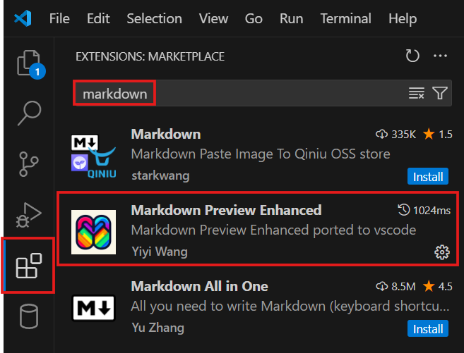

<h1 style="color:red">MinhEagle Tutorial !</h1>

<h4>===> Prerequisites</h4>

<h6>Steps :</h6>

* 1: Select Extension icon in Visual Studio Code.

* 2: Input "Markdown Preview Enhanced" to search bar.

* 3: Download extension.

    <h4>All tutorials :</h4>
    <a href="./python_basic/overview.md">1. Python Basic.</a>
     
    <a href="./javascript_basic/overview.md">2. Javascript Basic.</a>
     
    <a href="./java_basic/overview.md">3. Java Basic.</a>
     
    <a href="./go_basic/overview.md">4. Go Basic.</a>
     
    <a href="./automation_test/overview.md">5. Automation Testing.</a>

